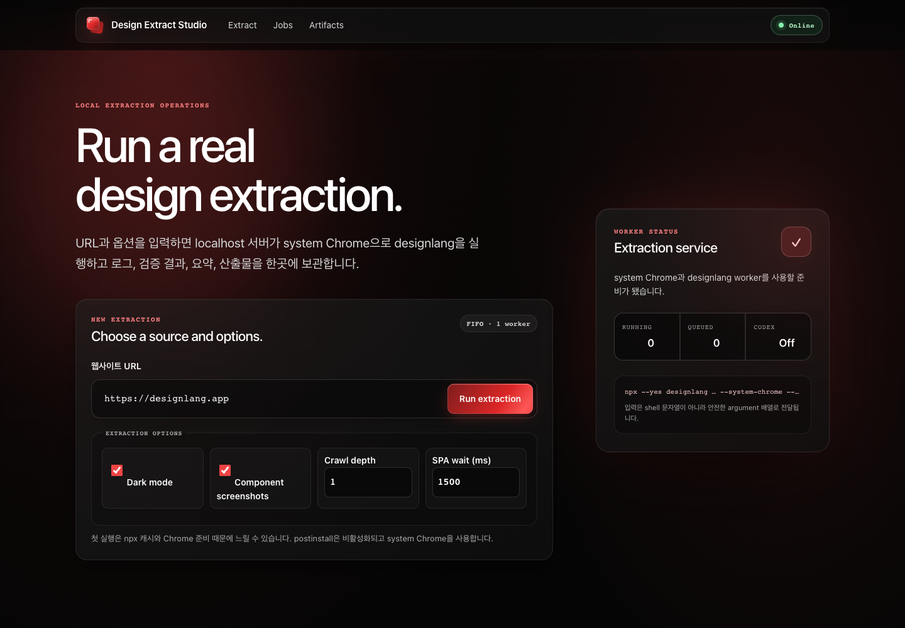
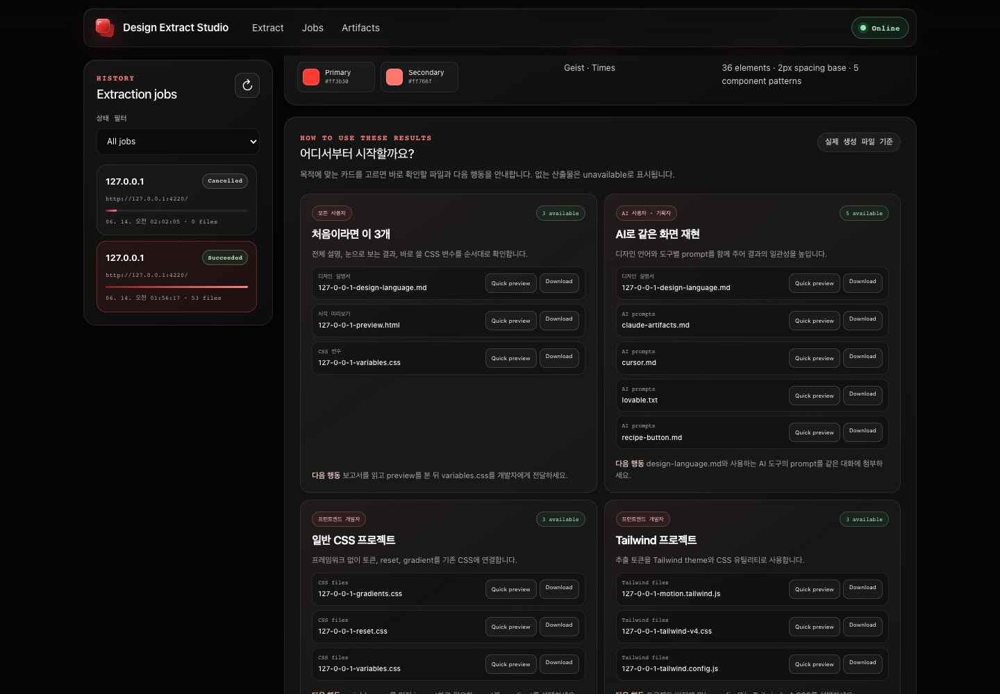
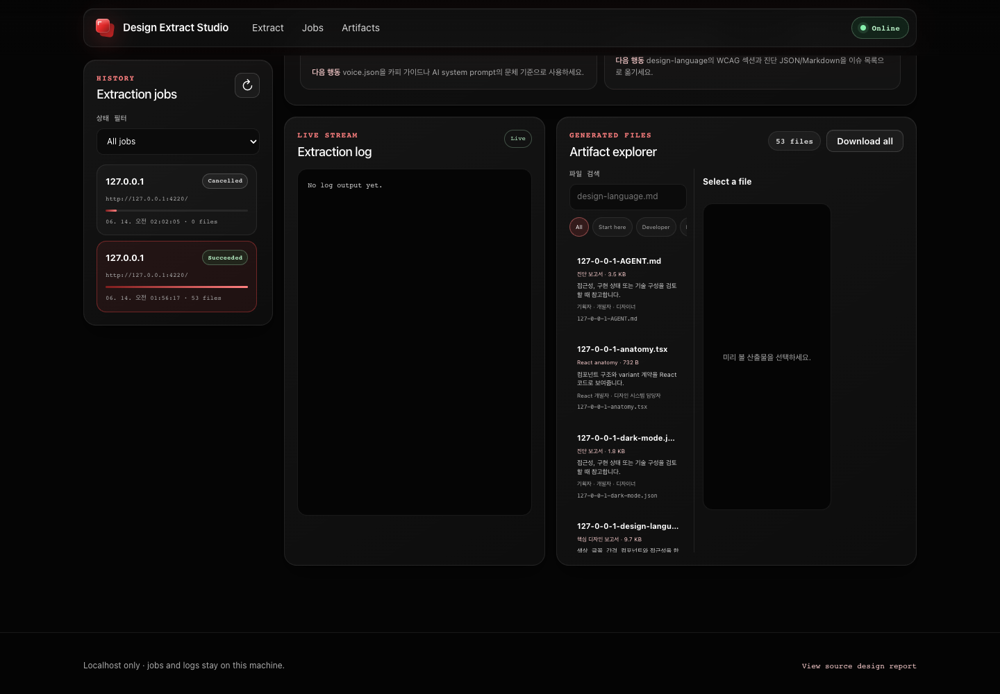
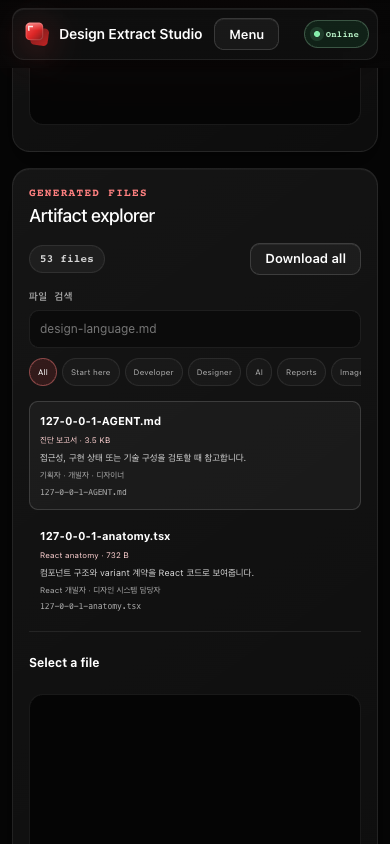

# Design Extract Studio

localhost에서 실제 `designlang` 추출을 실행하고 큐, 실시간 로그, 취소, 이력,
무결성 검사, 요약, 산출물 미리보기와 다운로드를 제공하는 로컬 제품입니다.
런타임 프레임워크와 외부 npm 의존성 없이 Node.js 내장 모듈만 사용합니다.

기존 `/Users/injukim/lazyer/designlang-test-output`은 읽기 전용 디자인
source of truth입니다. 서버는 이 디렉터리를 수정하지 않으며, 새 작업의 결과는
`design-extract-studio/jobs/<job-id>/artifacts`에 격리합니다.

이 프로젝트는 `designlang`을 외부 런타임 도구로 호출하는 독립 프로젝트이며
원본 프로젝트 또는 저자의 공식 제품이 아닙니다. 원본의 MIT 고지는
[`THIRD_PARTY_NOTICES.md`](./THIRD_PARTY_NOTICES.md)에 보존합니다.

추출 도구의 라이선스와 분석 대상 웹사이트의 저작권은 별개입니다. 생성된
로고, 이미지, 폰트, 문구 또는 디자인을 재배포하거나 제품에 적용하기 전에는
해당 사이트와 각 자산의 사용 조건을 별도로 확인해야 합니다.

## Screenshots

### Run a local extraction



### Understand and apply the generated files



### Search, preview, and download artifacts



### Mobile

<p align="center">
  
</p>

## 요구 환경

- Node.js 22.9 이상
- macOS 시스템 Chrome: `/Applications/Google Chrome.app`
- 네트워크에 접근 가능한 `npx`
- 기본 주소: `http://127.0.0.1:4219`

## 실행

```bash
cd /Users/injukim/lazyer/design-extract-studio
npm start
```

개발 모드와 테스트:

```bash
npm run dev
npm test
```

환경값을 바꾸려면 `.env.example`을 참고해 `.env`를 만듭니다. `npm start`와
`npm run dev`는 Node의 내장 `--env-file-if-exists`로 파일을 읽습니다.

첫 실행은 `npx`가 `designlang` 패키지 캐시를 준비하므로 느릴 수 있습니다.
기본 캐시 `/private/tmp/designlang-npm-cache`는 다음 실행에서 재사용됩니다.

### 백그라운드 서비스

현재 검증된 서버는 macOS launchctl label `com.designextract.studio`로 실행되며
PID와 로그는 다음 위치에 기록됩니다.

```text
.server/server.pid
.server/server.log
```

상태 확인과 종료:

```bash
launchctl print gui/$(id -u)/com.designextract.studio
launchctl remove com.designextract.studio
```

## 사용 흐름

1. URL과 dark mode, screenshots, depth, wait 옵션을 입력합니다.
2. 작업은 동시 실행 1개의 FIFO 큐에 들어갑니다.
3. SSE로 상태, 진행률과 로그를 확인하고 queued/running 작업을 취소합니다.
4. 완료 후 JSON, PNG, SVG, 빈 파일을 자동 검사합니다.
5. `*-design-language.md`의 score, grade, WCAG, 색상, 폰트, spacing과
   컴포넌트 패턴을 파싱해 표시합니다.
6. **How to use these results**에서 비개발자도 목적별 추천 파일과 다음 행동을
   확인하고 quick preview/download를 실행합니다.
7. artifact explorer에서 사람이 읽는 유형·용도·추천 사용자를 확인하고
   Start here, Developer, Designer, AI, Reports, Images 필터와 검색을 함께
   사용합니다.
8. 개별 파일 또는 모든 regular artifact를 안전한 `tar.gz`로 다운로드합니다.
9. loopback bind에서는 실제 artifact 폴더 경로를 확인하고 복사할 수 있습니다.

## 구조

| 경로 | 역할 |
|---|---|
| `server.mjs` | 설정, 저장소, 큐와 HTTP 서버를 조립하고 종료 시 자식 프로세스를 정리합니다. |
| `lib/http.mjs` | 정적 UI, REST API, SSE, 보안 헤더, body limit, MIME 응답을 처리합니다. |
| `lib/job-manager.mjs` | FIFO 상태 전이, 취소, retry, 복구, 검증과 요약 후처리를 담당합니다. |
| `lib/runner.mjs` | shell 없이 `spawn("npx", args)`로 designlang과 선택적 Codex를 실행합니다. |
| `lib/store.mjs` | `job.json`, `job.log`, artifacts를 원자적으로 저장합니다. |
| `lib/validation.mjs` | http/https URL, 옵션 타입, depth 0-5, wait 0-30000을 검증합니다. |
| `lib/artifacts.mjs` | 경로 traversal/symlink 방어, 목록, MIME, JSON/PNG/SVG 무결성을 처리합니다. |
| `lib/artifact-classification.mjs` | 파일명을 유형, 쉬운 용도, 추천 사용자와 UI 필터로 분류합니다. |
| `lib/archive.mjs` | regular file만 USTAR로 스트리밍하고 내장 gzip으로 압축합니다. |
| `lib/summary.mjs` | design-language Markdown의 핵심 지표를 파싱합니다. |
| `index.html`, `app.css`, `app.js` | 접근 가능한 반응형 UI와 실제 API/SSE 클라이언트입니다. |
| `test/` | 입력, 큐, 취소, 복구, traversal, MIME, summary와 API 테스트입니다. |
| `test-fixture/`, `scripts/fixture-server.mjs` | 실제 designlang E2E용 빠른 로컬 페이지입니다. |

## 실행 명령

각 작업은 환경에 `npm_config_ignore_scripts=true`와 캐시 경로를 설정하고 다음
형태의 argument 배열로 실행됩니다.

```text
npx --yes designlang <url> --system-chrome --quiet --no-history \
  --out <job-artifact-dir> --depth <0..5> --wait <0..30000>
```

선택된 경우에만 `--dark`, `--screenshots`가 추가됩니다. URL이나 옵션을 shell
문자열에 삽입하지 않습니다.

`designlang 12.18.0`은 이 환경에서 일반 출력 및 history 경로가 비대화형
실행 결과를 불안정하게 만드는 버그가 있어 `--quiet --no-history`를 항상
사용합니다. 이 옵션은 생성 산출물이나 대시보드 자체 로그 보존에는 영향을
주지 않습니다.

## API

| Method | Path | 설명 |
|---|---|---|
| `GET` | `/api/health` | 서버, 큐, 동시 실행 수와 Codex 설정 |
| `POST` | `/api/jobs` | 검증된 URL과 옵션으로 작업 생성 |
| `GET` | `/api/jobs?status=` | 이력 목록과 상태 필터 |
| `GET` | `/api/jobs/:id` | 작업 상세, 최근 로그, 검증과 요약 |
| `GET` | `/api/jobs/:id/events` | 상태와 로그 SSE |
| `POST` | `/api/jobs/:id/cancel` | queued/running 작업 취소 |
| `POST` | `/api/jobs/:id/retry` | 같은 입력으로 새 작업 생성 |
| `DELETE` | `/api/jobs/:id` | 종료된 작업과 산출물 삭제 |
| `GET` | `/api/jobs/:id/artifacts` | 산출물 목록 |
| `GET` | `/api/jobs/:id/artifacts-download` | 모든 안전한 regular file의 `tar.gz` 다운로드 |
| `GET` | `/api/jobs/:id/artifacts/<path>` | 안전한 미리보기 또는 `?download=1` 다운로드 |

API 응답은 `Cache-Control: no-store`를 사용합니다.
`GET /api/jobs/:id`의 `artifactPath`는 서버 bind가 `127.0.0.1`, `::1`,
`localhost` 중 하나이고 작업이 succeeded일 때만 포함됩니다.

## 산출물 활용 가이드

succeeded 작업에는 다음 목적 카드가 실제 생성 파일을 기준으로 표시됩니다.
파일 prefix가 달라지거나 `prompts/`처럼 하위 디렉터리에 있어도 suffix와 경로
구간으로 동적 매칭합니다.

- 처음이라면: `design-language.md`, `preview.html`, `variables.css`
- AI 재현: 디자인 설명서와 `prompts/`의 도구별 입력문
- 일반 CSS, Tailwind, shadcn/ui, Figma, React anatomy
- motion, brand voice, 접근성·진단 보고서

각 카드는 대상 사용자, 쉬운 목적 설명, 다음 행동과 실제 파일 quick
preview/download를 제공합니다. 생성되지 않은 파일은 임의 대체 없이
`Unavailable`로 표시됩니다.

Generated files 목록의 분류는 화면 표시만을 위한 추측이 아니라 API에서
제공하는 구조화 메타데이터입니다. 검색은 파일명, 경로, 유형, 용도와 추천
사용자를 함께 대상으로 하며 선택한 카테고리와 동시에 적용됩니다.

## 영속화와 복구

```text
jobs/<job-id>/
├── job.json
├── job.log
└── artifacts/
```

`job.json`에는 상태, PID, 시간, exit code, 진행률, integrity, summary가
저장됩니다. 재시작 시 queued 작업은 다시 FIFO 큐에 들어가고, 이전에 running
이던 작업은 `failed / INTERRUPTED`로 정리됩니다.

## 디자인 Source Of Truth

UI는 추출 원본을 복제하지 않고 `/source-assets/*`를 통해 직접 읽습니다.

| 원본 산출물 | 제품 사용 |
|---|---|
| `designlang-app-reset.css` | 앱 전체 reset 기준 |
| `designlang-app-variables.css` | `#050505`, red 계열, Geist, spacing, radius, shadow의 우선 변수 |
| `designlang-app-motion.css` | hero 진입 모션과 motion token |
| `designlang-app-logo.svg` | favicon과 상단 브랜드 |
| `designlang-app-design-tokens.json` | 색상, radius, shadow 설계와 summary UI 기준 |
| `designlang-app-motion-tokens.json` | duration/easing 및 reduced-motion 구현 기준 |
| `designlang-app-voice.json` | neutral, direct, sentence-case 제품 문체 기준 |
| `designlang-app-anatomy.tsx` | primary/ghost 버튼과 card anatomy 기준 |
| `designlang-app-screenshots.json`, PNG | 추출된 컴포넌트 패턴의 시각 검증 기준 |

원본의 WCAG 17% 문제는 복제하지 않았습니다. 앱은 어두운 표면 위 AA 대비
텍스트, 텍스트가 포함된 상태 배지, 3px `focus-visible` outline과 외부 ring,
`aria-live`, 키보드 메뉴, `prefers-reduced-motion`을 제공합니다.

원본을 다시 추출하면 같은 파일명으로 갱신하고 서버를 새로고침합니다.
`designlang-test-output`은 수동 편집하지 않고, 접근성 보정과 제품 레이아웃은
`app.css`에만 유지합니다.

## 선택적 Codex 분석

기본값은 OFF입니다.

```bash
ENABLE_CODEX_ANALYSIS=1 npm start
```

활성화하면 extraction 성공 후 `codex exec`를 비대화형, read-only sandbox,
approval never, 고정 prompt로 실행해 `analysis.md`를 생성합니다. URL이나
산출물 텍스트는 prompt 명령으로 조합하지 않습니다. Codex가 없거나 실패해도
추출 성공 상태는 유지됩니다.

## 보안

- 기본 bind는 `127.0.0.1`이며 외부 공개 서버 용도가 아닙니다.
- URL은 `http:`와 `https:`만 허용하고 credentials를 거부합니다.
- request body는 16 KiB로 제한합니다.
- 자식 프로세스는 shell 없이 고정 command와 argument 배열로 실행합니다.
- artifact 경로는 decode, root containment, symlink와 traversal을 검사합니다.
- 전체 다운로드는 artifact root 아래의 regular file만 포함하고 symlink,
  절대 경로, `..`, 지나치게 긴 tar 경로를 제외하거나 거부합니다.
- bundle filename은 검증된 job ID로만 만들며 안전한 `Content-Disposition`을
  사용합니다.
- 로컬 절대 경로는 loopback bind에서만 API로 노출합니다.
- HTML/SVG artifact는 sandbox CSP로 제공하고 다운로드 응답을 지원합니다.
- API는 no-store, UI는 제한된 CSP와 보안 헤더를 사용합니다.
- 로그는 프로젝트, jobs, artifact와 홈 경로를 축약하고 민감한 env 패턴을
  마스킹합니다.

localhost라도 신뢰하지 않는 URL은 브라우저 엔진에서 처리됩니다. 개인용
워크스테이션에서만 실행하고 `HOST=0.0.0.0`으로 공개하지 마십시오.

## 문제 해결

**`Playwright is not installed`가 표시됨**

`--system-chrome`이어도 designlang 12.18.0은 Chrome launch 오류를 이 문구로
표시할 수 있습니다. `/Applications/Google Chrome.app` 존재 여부와 실행
권한을 확인합니다. sandbox 환경에서는 Chrome이 `SIGABRT`/`EPERM`으로 막힐
수 있으므로 서버 자체를 해당 sandbox 밖에서 실행해야 합니다.

**postinstall에서 멈춤**

서버는 `npm_config_ignore_scripts=true`를 강제하므로
`playwright install chromium --with-deps`를 실행하지 않습니다. 시스템
Chrome과 기존 npx 캐시를 사용합니다.

**첫 실행이 오래 걸림**

`/private/tmp/designlang-npm-cache`가 비어 있으면 npx 패키지 준비 시간이
필요합니다. 작업 로그에서 PID와 진행 상태를 확인하고 첫 실행을 기다립니다.

**서버 재시작 후 작업 실패**

실행 중 자식 프로세스는 서버 종료 시 TERM 후 필요하면 KILL됩니다. 재시작 때
해당 작업은 데이터 손상을 숨기지 않도록 `INTERRUPTED` 실패로 표시됩니다.

## 검증 기록

- `npm test`: 22개 단위·통합 테스트 통과
- classification: prefix/중첩 경로, 사용자·용도 필터 분류 검증
- bundle: gzip 해제, tar 엔트리/내용, symlink 제외, MIME과
  `Content-Disposition` 검증
- artifactPath: loopback 노출 및 non-loopback 비노출 검증
- 실제 fixture extraction: succeeded, 53 files, JSON 15/15, PNG 11,
  empty 0, integrity pass
- summary: design score 98/A, WCAG 100%, spacing base 2px
- 브라우저: 1440x1000과 390x844 모두 overflow 0
- 콘솔 오류, page error, 404, request failure: 0
- 목적 가이드 10개, Start here 3개 동적 매칭, 검색+사용자 필터,
  quick preview/download, Download all, Copy path 검증 완료
- UI에서 받은 bundle을 시스템 `tar -tzf`로 열어 53개 파일과
  `prompts/`, `screenshots/` 중첩 경로를 확인
- form submit/cancel, refresh, 이력, 상세, 모바일 메뉴, Tab
  focus-visible 3px outline, reduced motion 검증 완료
- 스크린샷:
  `/private/tmp/designlang-guide-desktop.png`,
  `/private/tmp/designlang-guide-mobile.png`
